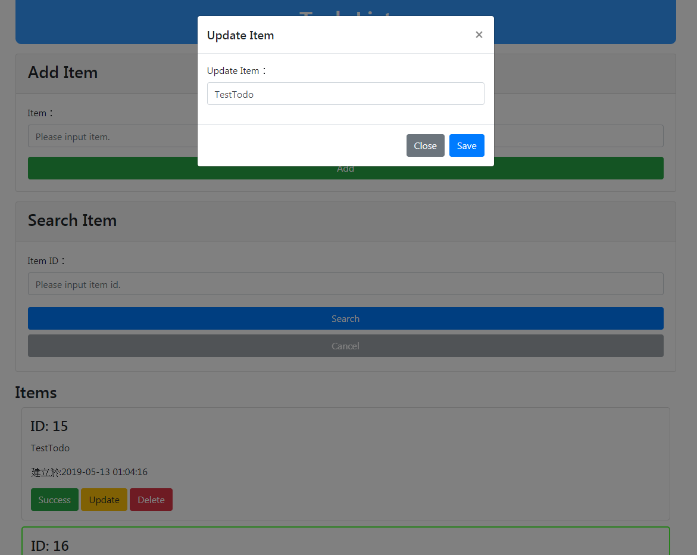

# laiPHP ToDoList

基於 [laiPHP](https://github.com/LaiJunBin/laiPHP)

Demo: [todolist](http://3.112.191.90/)

首頁

## 使用步驟
* 下載後解壓縮
* 把 env.php 設定好
* 將 todos.sql 匯入mysql中env.php設定的DATA_BASE中
* 將 php 加入到環境變數中
* cmd 輸入 php lai serv 執行測試伺服器
* 到瀏覽器輸入 env.php 中的HOST:PORT，預設為localhost:8000